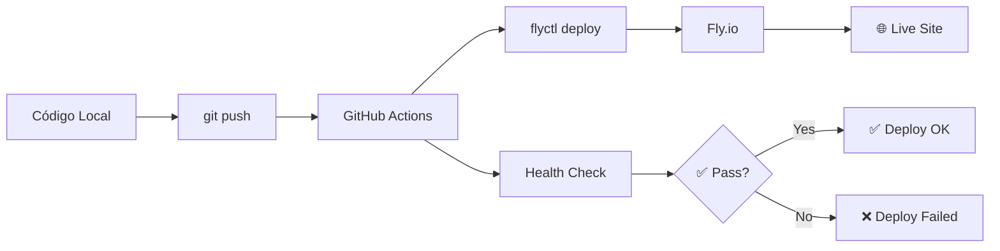

# 🐙 GitHub Setup - TV Dashboard

Guia completo para configurar o projeto no GitHub com deploy automático via GitHub Actions.

## 🚀 Setup Rápido (Recomendado)

```bash
# 1. Setup automático GitHub
make github-setup

# 2. Configurar secrets (manual)
# GitHub → Settings → Secrets → Actions
# Adicionar: FLY_API_TOKEN

# 3. Obter token Fly.io
make fly-token

# 4. Primeiro push
make github-push
```

## 📋 Setup Manual Passo a Passo

### 1. **Criar Repositório GitHub**

#### Via GitHub CLI (Recomendado)
```bash
# Instalar GitHub CLI se necessário
brew install gh

# Login
gh auth login

# Criar repositório
gh repo create tv-dashboard --public --description "📺 TV Dashboard - Professional streaming platform"

# Clonar (se criado online)
git clone https://github.com/SEU_USER/tv-dashboard.git
cd tv-dashboard
```

#### Via Interface Web
1. Acesse: https://github.com/new
2. Nome: `tv-dashboard`
3. Descrição: `📺 TV Dashboard - Professional streaming platform`
4. Público/Privado conforme preferência
5. Criar repositório

### 2. **Configurar Git Local**

```bash
# Inicializar git (se necessário)
git init

# Configurar remote
git remote add origin https://github.com/SEU_USER/tv-dashboard.git

# Verificar configuração
git remote -v
```

### 3. **Configurar Secrets GitHub**

#### Obter Token Fly.io
```bash
# Fazer login no Fly.io
fly auth login

# Obter token para GitHub
fly auth token
```

#### Adicionar Secrets no GitHub
1. Vá para: `https://github.com/SEU_USER/tv-dashboard/settings/secrets/actions`
2. Clique em **"New repository secret"**
3. Adicione:

| Name | Value | Descrição |
|------|-------|-----------|
| `FLY_API_TOKEN` | `fly_xxxxx...` | Token de autenticação do Fly.io |

### 4. **Primeiro Deploy**

```bash
# Adicionar todos os arquivos
git add .

# Commit inicial
git commit -m "🚀 Initial commit - TV Dashboard with Fly.io deploy"

# Definir branch principal
git branch -M main

# Push inicial
git push -u origin main
```

## 🔄 Workflow GitHub Actions

### **Arquivo**: `.github/workflows/deploy.yml`

O workflow é acionado automaticamente quando:
- **Push** para branch `main` ou `master`
- **Pull Request** para `main` ou `master`

### **Processo de Deploy**:

1. **🔍 Checkout**: Baixa código do repositório
2. **🛠️ Setup**: Instala `flyctl` 
3. **🚀 Deploy**: Executa `flyctl deploy --remote-only`
4. **✅ Tests**: Testa health endpoint e página principal
5. **📊 Report**: Reporta status do deploy

### **Monitoramento**:
- **Actions**: https://github.com/SEU_USER/tv-dashboard/actions
- **Live Site**: https://tv-dashboard.fly.dev/
- **Health**: https://tv-dashboard.fly.dev/health

## 📤 Deploy Contínuo

### **Deploy via Commit**

```bash
# Método 1: Comando automatizado
make git-deploy

# Método 2: Manual
git add .
git commit -m "✨ Nova feature implementada"
git push
```

### **Monitorar Deploy**

```bash
# Ver status GitHub Actions
make github-status

# Ver logs Fly.io (após deploy)
make fly-logs

# Testar aplicação
make test
```

## 🏷️ Badges README

Adicione badges ao seu README:

```markdown
[](https://github.com/SEU_USER/tv-dashboard/actions/workflows/deploy.yml)
[](https://tv-dashboard.fly.dev/)
```

## 🛠️ Comandos Úteis

### **Git e GitHub**
```bash
make github-setup     # Setup inicial GitHub
make github-push      # Primeiro push
make git-deploy       # Deploy via commit
make github-status    # Status Actions
make fly-token        # Token para secrets
```

### **Fly.io Integration**
```bash
make fly-status       # Status app Fly.io  
make fly-logs         # Logs em tempo real
make fly-deploy       # Deploy manual
```

### **Desenvolvimento**
```bash
make dev              # Servidor local
make docker           # Teste local Docker
make test             # Health checks
```

## 🐛 Troubleshooting

### **Deploy Falhando**

1. **Verificar Secrets**:
   ```bash
   # Token válido?
   fly auth token
   
   # Secret configurado?
   # GitHub → Settings → Secrets → Actions
   ```

2. **Verificar Workflow**:
   ```bash
   # Ver logs completos
   # GitHub → Actions → Deploy workflow → Ver detalhes
   ```

3. **Testar Local**:
   ```bash
   # Deploy local funciona?
   make fly-deploy
   ```

### **Problemas Comuns**

| Problema | Solução |
|----------|---------|
| `FLY_API_TOKEN not found` | Configurar secret no GitHub |
| `App not found` | Verificar nome no `fly.toml` |
| `Build failed` | Testar `make docker` local |
| `Health check failed` | Verificar `/health` endpoint |

### **Regenerar Token**

```bash
# Novo token Fly.io
fly auth token

# Atualizar secret GitHub
# Settings → Secrets → Actions → FLY_API_TOKEN → Update
```

## 📈 Fluxo Completo Produção



## 🎯 Próximos Passos

Após configurar GitHub Actions:

1. **🔄 Desenvolvimento**: Trabalhe normalmente com git
2. **📤 Deploy**: Automático a cada push para main  
3. **📊 Monitor**: Acompanhe via GitHub Actions
4. **🌐 Acesso**: https://tv-dashboard.fly.dev/

## 📚 Links Úteis

- **GitHub Actions**: https://docs.github.com/en/actions
- **Fly.io Deploy**: https://fly.io/docs/app-guides/continuous-deployment-with-github-actions/
- **Fly.io CLI**: https://fly.io/docs/flyctl/
- **Docker Hub**: https://hub.docker.com/ 